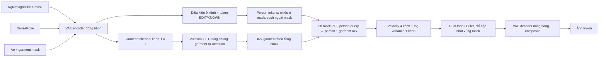

# Kiến trúc PFI-VTON: PFT-XL/2 được giữ lại và phần mở rộng cho thử đồ

Tài liệu này mô tả **code hiện tại** của `VTONInpaintDiT`, từ đầu vào ảnh đến ảnh thử đồ. [Mở sơ đồ tương tác](pfi_vton_architecture.html) để đổi độ phân giải, batch, chế độ train/inference và xem shape ở từng khối. Quy ước shape là `B × C × H × W`; `B` là batch size. `t=0` là nhiễu, `t=1` là dữ liệu sạch. V43–V45 đều dùng kiến trúc này; các config thay đổi cách khởi tạo, phân phối thời gian, loss và lịch train.

## 1. Tổng thể và nguồn gốc



Nền gốc là [`PatchForcingDiT`](../patch_flow/models/pf_transformer.py): PFT-XL/2 đã huấn luyện ở latent vuông `32×32` (ảnh `256×256`), patch latent `2×2` nên có `16×16 = 256` token, width `1152`, `28` DiT block, `16` head (`72` chiều/head), embedding thời gian **theo token**, adaLN, final layer dự đoán velocity và log-variance. [`VTONInpaintDiT`](../vton_ext/pfi_model.py) kế thừa class này, **không phải giữ nguyên model**. `input_size=32` trong lời gọi `super()` chỉ khởi tạo cấu trúc/weight gốc; subclass thay bảng vị trí, luồng `forward`, cách attention, unpatchify và đầu vào điều kiện cho lưới chữ nhật.

| Thành phần | PFT-XL/2 gốc | PFI-VTON hiện tại | Kết luận |
| --- | --- | --- | --- |
| Patch embed person `4→1152`, patch `2×2` | Có | Giữ weight, tiếp tục fine-tune | **Giữ** |
| 28 block, width 1152, 16 head, q/k normalization, adaLN và MLP | Có | **Cùng một bộ weight** chạy cho garment và person; person dùng K/V nối thêm từ garment | **Giữ weight, đổi topology attention** |
| Timestep từng patch và null-class embedding | Có | Giữ; gán `t=1` cho context/garment, `t_i` cho vùng edit; thêm role condition | **Giữ và sử dụng cho VTON** |
| Final layer `5` kênh latent, gồm velocity `4` + log-variance `1` | Có | Giữ weight, chỉ xuất từ person tokens | **Giữ** |
| Bảng vị trí `16×16` | Có | Nội suy bicubic sang `32×24` hoặc `64×48`; V45 cho phép fine-tune | **Thay hình dạng/khả năng train** |
| Embedding điều kiện agnostic + mask + pose | Không | Conv `9→1152`, khởi tạo zero | **Thêm** |
| Luồng áo sạch và K/V cache | Không | Conv `5→1152`; garment chạy 28 block cùng weight, tự attention và cache K/V | **Thêm** |
| Role `EDIT`, `KNOWN`, `GARMENT` | Không | Hai bảng `3×1152` cho token và adaLN condition | **Thêm** |
| CoRAL / DINOv3 teacher | Không | Giám sát định tuyến attention ở 4 block giữa khi train | **Thêm, chỉ train** |
| VAE của Stable Diffusion | Không nằm trong DiT gốc | Encoder/decoder ngoài DiT, đóng băng | **Pipeline VTON** |
| Dual-loop uncertainty-guided sampler | Có trong PFT | Tái dùng ý tưởng, chỉ cập nhật mask và dùng K/V garment cache | **Điều chỉnh cho VTON** |

Các module học mới của riêng VTON gồm **73.728 tham số** (hai Conv và hai bảng role), bên cạnh backbone fine-tune. Ở V45, còn **3.538.944 phần tử của bảng vị trí** được cho phép fine-tune; đây là weight vị trí đã nội suy, không phải một luồng transformer mới. Xem [`pfi_model.py`](../vton_ext/pfi_model.py) và [config V45](../configs/vton_v45_pfi_1024.yaml).

## 2. Shape theo độ phân giải

VAE giảm `8×` mỗi chiều; patch embedding giảm tiếp `2×` mỗi chiều. Vì thế một token ứng với ô `16×16` pixel RGB. Các shape sau là **mỗi luồng** (person hoặc garment), không cộng cả hai.

| Tensor hoặc kích thước | 512×384 (V40–V42) | 1024×768 (V43–V45) |
| --- | ---: | ---: |
| RGB đầu vào / đầu ra | `[B,3,512,384]` | `[B,3,1024,768]` |
| Agnostic mask, garment mask RGB | `[B,1,512,384]` | `[B,1,1024,768]` |
| Mỗi VAE latent RGB | `[B,4,64,48]` | `[B,4,128,96]` |
| Mask latent | `[B,1,64,48]` | `[B,1,128,96]` |
| `cond = [agnostic, mask, DensePose]` | `[B,9,64,48]` | `[B,9,128,96]` |
| `garment_input = [garment, garment_mask]` | `[B,5,64,48]` | `[B,5,128,96]` |
| `edit_tokens` / thời gian `t_i` | `[B,768]` boolean / float | `[B,3072]` boolean / float |
| `edit_pixels` (mask đã trải về latent) | `[B,1,64,48]` | `[B,1,128,96]` |
| Lưới token `(H/16) × (W/16)` | `32×24` | `64×48` |
| `N` token mỗi luồng | `768` | `3072` |
| Person/garment hidden | `[B,768,1152]` | `[B,3072,1152]` |
| Q/K/V của một luồng | `[B,16,768,72]` | `[B,16,3072,72]` |
| K/V mà person đọc sau phép nối | `[B,16,1536,72]` | `[B,16,6144,72]` |
| Map CoRAL ở mỗi block được chọn | `[B,4,768,768]` | `[B,4,3072,3072]` |
| Final tokens | `[B,768,20]` | `[B,3072,20]` |
| Velocity / log-variance | `[B,4,64,48]` / `[B,1,64,48]` | `[B,4,128,96]` / `[B,1,128,96]` |

`20 = 2×2×(4+1)`. Khi tăng 512→1024 theo mỗi chiều, token/luồng tăng `4×`, còn số cặp query–key trong attention tăng `16×`; shape `N×2N` là **kích thước logic**, PyTorch SDPA không nhất thiết tạo ma trận đầy đủ. Bốn map CoRAL `N×N` ở train vẫn tốn bộ nhớ đáng kể; DINO similarity cũng là `[B,N,N]`. Đây là lý do tăng độ phân giải không chỉ là đổi `image_hw`. Xem [`pfi_model.py`](../vton_ext/pfi_model.py), [`coral.py`](../vton_ext/coral.py) và [`utils.py`](../vton_ext/utils.py).

## 3. Chuẩn bị đầu vào

[`prepare_inputs`](../vton_ext/pfi_sample.py) chỉ đọc agnostic RGB `A`, mask `M`, DensePose `P`, garment RGB `G` và garment mask `M_G`; **ảnh target không có trong đầu vào inference**. Mask được giãn bằng max-pool (`mask_open_px`), phần được che trong agnostic RGB được đưa về giá trị fill `0` trên thang `[-1,1]`. Frozen VAE encode `A`, `P`, `G` thành ba latent 4 kênh. Mask pixel được đưa về latent, tạo boolean `edit_tokens[B,N]`; `edit_pixels[B,1,h,w]` trải lại token mask lên từng patch latent.

```text
known        = E(A · (1 − M_open))                         [B,4,h,w]
cond         = concat(known, mask_latent, E(P), dim=C)     [B,9,h,w]
garment_in   = concat(E(G), garment_mask_latent, dim=C)    [B,5,h,w]
edit_tokens  = any-mask-overlap trên patch latent 2×2      [B,N] bool
```

`E` là VAE encoder đóng băng. Garment mask được average-pool; mask edit latent dùng phép pooling bảo thủ rồi gom token. Target ảnh thật `I` chỉ được encode thành `x₁` trong training, không đi vào điều kiện của model. VAE encoder/decoder và DINO teacher không thuộc 28 block PFT.

## 4. Bên trong DiT: hai luồng, một bộ trọng số

**Person**: `x[B,4,h,w]` qua patch embed gốc, cộng projection điều kiện 9 kênh, vị trí và role `EDIT/KNOWN` → `h_p[B,N,1152]`. AdaLN condition mỗi token là `TimeEmbed(t_i) + null_class + role_cond[r_i]` cùng shape. Projection điều kiện bắt đầu bằng zero nên ban đầu không làm lệch đầu vào pretrained; role token/condition cũng khởi tạo zero.

**Garment**: latent áo và mask 5 kênh qua Conv mới (4 kênh ảnh chép từ patch embed gốc, kênh mask zero), cộng vị trí và role `GARMENT` → `h_g[B,N,1152]`. Mọi token áo có `t=1`. Mỗi block tính self-attention **chỉ trong áo** rồi MLP. Nó lưu `(K_g,V_g)` của chính block đó. Không có đường person→garment.

**Mỗi block `ℓ = 0…27`** dùng cùng `blocks[ℓ]` cho hai lần cập nhật:

```text
garment: Q_g [B,16,N,72] × K_gᵀ [B,16,72,N]
         → SDPA(garment → garment) → h_g kế tiếp + cache(K_g,V_g)

person:  Q_p [B,16,N,72]
         K = concat(K_p,K_g) [B,16,2N,72]
         V = concat(V_p,V_g) [B,16,2N,72]
         → SDPA(person → person + garment) → h_p kế tiếp
```

Person đọc áo và context của chính mình; áo không thấy trạng thái person. Vì vậy `encode_garment` tính đúng cùng K/V tại mọi bước lấy mẫu và cache 28 cặp K/V **một lần/ảnh** (hai lần nếu tạo thêm cache áo rỗng cho CFG). Cache này là chính xác theo topology, không phải xấp xỉ. Luồng áo dùng chung weight block với person, **không có ReferenceNet thứ hai**. [`pfi_model.py`](../vton_ext/pfi_model.py).

Ở block index `8,12,16,20`, bốn head đầu trả thêm map `softmax(Q_p K_gᵀ / √72)` trên **chỉ garment keys**. Attention thật trong SDPA lại chuẩn hóa trên **person + garment keys**. Vì thế CoRAL dạy vị trí đọc trên áo; riêng map này **không đo được tỷ lệ attention tổng thực sự đổ vào áo**. Mười hai head còn lại không nhận loss định tuyến trực tiếp.

Final layer gốc biến person token thành `[B,N,20]`, unpatchify thành `[B,5,h,w]`, tách velocity `v[B,4,h,w]` và log-variance `s[B,1,h,w]`. Đầu ra áo không được unpatchify thành ảnh riêng.

## 5. Training: phần học thêm cho VTON

Mỗi mẫu paired có target RGB `I`; frozen VAE cho `x₁=E(I)`. Chọn thời gian `t_i` cho từng token edit; token known luôn có `t_i=1`. Với `ε∼N(0,I)`, latent đầu vào và flow target là:

```text
x_t = t_i·x₁ + (1−t_i)·ε   tại patch EDIT
x_t = known                 tại patch KNOWN
u   = x₁ − ε               (chỉ tính flow loss trên vùng EDIT)
```

[`EditTimeSampler`](../vton_ext/pfi_train.py) trộn bốn loại ví dụ: **pure noise** (`t=0`, buộc dựa vào áo/pose), **synchronous** (cùng thời gian trong vùng edit), **detail** (thời gian gần sạch), và **LTG patch forcing** (thời gian khác nhau theo patch). V40 chuyển trọng số sau khi `coral_local_mass` vượt ngưỡng hoặc tới giới hạn step: `(pure,sync,detail,LTG)` từ `(0.50,0.20,0,0.30)` sang `(0.10,0.15,0.40,0.35)`. V45 khởi đầu trực tiếp ở hỗn hợp cuối, vì đây là fine-tune từ checkpoint V44, không phải curriculum học áo lại từ đầu. V45 train áp `time_shift=2` cho các nhánh trừ `detail` (`detail_unshifted=true`), còn eval dùng `time_shift=1`; đây là **thời gian**, không đổi shape tensor. Xem [V40](../configs/vton_v40_pfi_coral.yaml) và [V45](../configs/vton_v45_pfi_1024.yaml).

Loss: flow MSE có tăng trọng số ở vùng áo; NLL từ log-variance; CoRAL CE + entropy cho bốn block; và ở các mẫu được chọn, endpoint `x̂₁=x_t+(1−t)·v` đi qua frozen VAE decoder **có truyền gradient qua decoder tới model** để tính loss RGB/high-pass. DINOv3-S/16 teacher đóng băng encode target người và áo, tạo similarity `[B,N,N]`, chọn correspondence đáng tin cậy bằng similarity/cycle consistency. Teacher chỉ có trong train, không phải input ở inference. V43 pilot từng dùng crop cho decoded loss; [V45](../configs/vton_v45_pfi_1024.yaml) đặt `decoded_crop_latent: null`, nghĩa là decoded loss trên ảnh đầy đủ khi được kích hoạt. Các đường loss xem [`pfi_train.py`](../vton_ext/pfi_train.py) và [`coral.py`](../vton_ext/coral.py).

## 6. Inference: shape và số lần gọi model

[`generate`](../vton_ext/pfi_sample.py) khởi đầu vùng edit từ Gaussian noise `[B,4,h,w]`, vùng known từ agnostic latent; `t_edit=0`, `t_known=1`. Mỗi lần gọi person denoiser dùng lại 28 cặp garment K/V. Chỉ patch edit được tăng `t` và cập nhật `x`; cuối cùng known được ép lại chính xác. `dual_loop` chọn hard tokens theo quantile của `exp(logvar)`; ở `p=0.7`, khoảng 30% token edit có uncertainty cao được chia thành các bước nhỏ, easy tokens tiến cả khoảng. Mỗi lần gọi vẫn xử lý toàn bộ person sequence, **không phải chỉ 30% query**. Với `NFE=8`, `n_inner=2`, có `4` outer interval × `2` person evaluation; CFG scale `1` cần `8` person calls và `1` garment encode, CFG khác `1` cần `16` person calls và `2` garment encode (áo thật + áo rỗng). Khi CFG khác 1, số person calls thực tế gấp đôi NFE.

Latent cuối `[B,4,h,w]` qua frozen VAE decoder → `[B,3,H,W]`; [`composite`](../vton_ext/pfi_sample.py) giữ pixel người quan sát được ngoài mask và dùng ảnh sinh trong mask; V45 bật seam correction khi eval. Chi phí attention người `N` query × `2N` key tăng `16×` về số cặp khi tăng từ 512 lên 1024, dù shape weight của 28 block giữ nguyên.

## 7. Đọc sơ đồ và kiểm chứng

Mở [**app kiến trúc tương tác**](pfi_vton_architecture.html) trực tiếp bằng trình duyệt hoặc chạy `python3 -m http.server 8080 --directory docs` rồi vào `http://localhost:8080/pfi_vton_architecture.html`. Chọn độ phân giải/batch để xem shape; chọn Train để hiện target, DINO/CoRAL và loss; chọn Inference để xem NFE, CFG và số lời gọi thực tế. Click từng khối để đọc công thức và file triển khai. Phần *recipe* của app dùng V40 khi chọn 512×384 và V45 khi chọn 1024×768; shape của các bản V41/V42 hoặc V43/V44 ở cùng độ phân giải là tương ứng, nhưng loss/config có thể khác.

Shape được suy từ `image_hw`, downsample VAE `8`, patch size `2` và các phép `concat`/`split` trong code; **không phải dấu vết chạy model trên checkpoint**. Tài liệu này giải thích kiến trúc và luồng tensor, không tự chứng minh chất lượng ảnh hay độ đúng của logo ở 1024×768.

## Nguồn học thuật để đối chiếu

- J. Schusterbauer và cộng sự, [*Denoising, Fast and Slow: Difficulty-Aware Adaptive Sampling for Image Generation*](https://arxiv.org/abs/2604.19141), CVPR 2026 — phương pháp Patch Forcing gốc. Kiến trúc **PFI-VTON cụ thể** được xác định từ code trong repository, không được mô tả trong bài gốc này.
- S. Choi và cộng sự, [*VITON-HD: High-Resolution Virtual Try-On via Misalignment-Aware Normalization*](https://arxiv.org/abs/2103.16874), CVPR 2021 — bài báo và dữ liệu thử đồ ở 1024×768.
- O. Siméoni và cộng sự, [*DINOv3*](https://arxiv.org/abs/2508.10104), arXiv:2508.10104, 2025 — nền tảng feature teacher; cách tạo target CoRAL ở đây là triển khai riêng của [`coral.py`](../vton_ext/coral.py).
