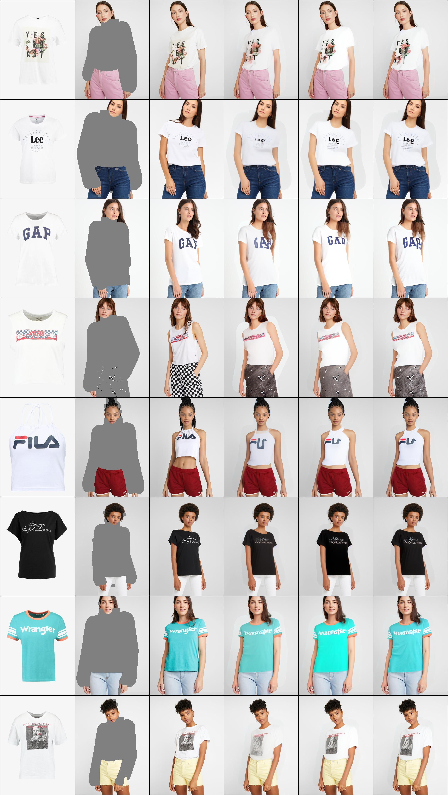
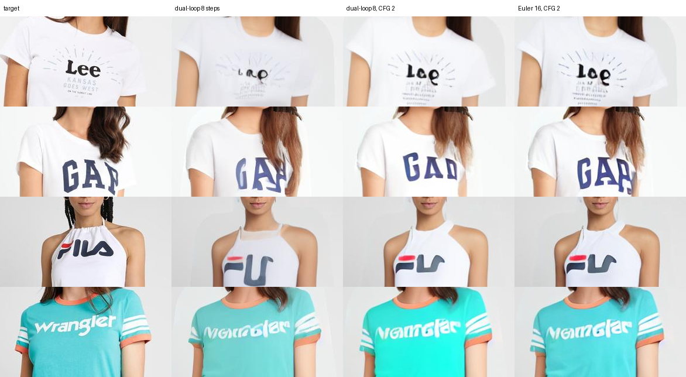

# PFI-VTON: Patch-Forcing Inpainting for Virtual Try-On (V40–V42)

Method and results notes for the paper. Covers only the V40 → V41 → V42
lineage (code: `vton_ext/pfi_model.py`, `vton_ext/pfi_train.py`,
`vton_ext/pfi_sample.py`). Nothing from V1–V33 (warper, transport, detail
paste, attention-only LoRA) is used.

Status on 24 September 2026: V42 is training (step ≈ 8,900 of 20,000). All
numbers below are measured on the internal paired development split
(`train_dev_pairs.txt`, 256 pairs). **The official VITON-HD test set has not
been run, and no baseline has been evaluated under our protocol.** Section 9
lists what the paper still needs.

---

## 1. One-paragraph summary (draft abstract material)

We cast virtual try-on as *patch-forcing inpainting*. A single pretrained
Patch-Forcing DiT (PFT-XL/2) processes the person latent as tokens with
individual timesteps. Tokens inside the agnostic mask start from pure Gaussian
noise, while observed person tokens and in-shop garment tokens are clean
context at t = 1. Patch forcing's per-token time embedding therefore represents
"known context", "reference garment" and "region to generate" in one
mechanism, with no ReferenceNet, warper or extra UNet. The garment tokens pass
through the same weights but attend only to themselves, so their keys and
values do not depend on the noisy person state. They are computed once per
image and reused at every denoising step (exact caching). DINOv3
correspondences supervise the person→garment attention (CoRAL-style) in four
middle blocks. A correspondence-gated time curriculum first forces the model
to read the garment from pure noise, then shifts training to late,
near-clean times where the remaining error is high-frequency detail. At
inference, only masked tokens are integrated, and patch-forcing's
uncertainty-guided dual-loop sampler spends finer steps on uncertain patches.
At eight network evaluations it beats Euler at 8, 25 and 50 evaluations on all
256 dev pairs.

---

## 2. Problem setup and notation

| Symbol | Meaning |
| --- | --- |
| `I` | target person image, 512×384 RGB in [-1, 1] (training only) |
| `A`, `M` | agnostic image and agnostic mask (VITON-HD) |
| `P` | DensePose visualisation |
| `G`, `M_G` | in-shop garment image and garment mask |
| `E(·)` | frozen SD-VAE encoder (scale 0.18215), 8× downsampling → 64×48×4 |
| `z1 = E(I)` | clean target latent |
| `N = 32·24 = 768` | tokens per stream (latent patch size 2) |
| `t_i ∈ [0,1]` | time of token *i*; 0 = noise, 1 = clean |
| `z_t` | `t·z1 + (1−t)·ε` per token, `ε ~ N(0, I)` |
| `u = z1 − ε` | rectified-flow velocity target |

Inputs available at inference: `A, M, P, G, M_G`. The target `I` is used only
for the training targets, the DINOv3 teacher, and loss weights; it never
enters the model or the sampler.

**Mask opening.** Before encoding, `M` is dilated by `r` pixels with max
pooling (`open_mask`): `r ~ U{0..12}` per training sample, `r = 6` at
inference. The added ring is set to the VITON-HD gray fill in `A` and becomes
editable. This makes the model robust to slightly-too-tight masks: leftover
old-garment pixels at the mask border cannot leak into the context, and the
ring is regenerated.

Derived inputs (`prepare_inputs`):

```text
z_A   = E(A ⊙ (1 − M_open))            known context latent
m     = adaptive_maxpool(M_open) → 64×48  (conservative: any masked pixel)
z_P   = E(P)
z_G   = E(G ⊙ keep),  m_G = avgpool(M_G) ⊙ keep   (keep = 0 for garment dropout)
edit_i = token i overlaps m   (2×2 latent patch)
```

---

## 3. Architecture

### 3.1 Backbone

Released PFT-XL/2 ImageNet-256 checkpoint (`pft-xl_step400k_ema.ckpt`): 28
DiT blocks, width 1152, 16 heads (head dim 72), adaLN-Zero conditioning with a
**per-token** timestep embedding, and an extra output channel predicting a
per-pixel log-variance (uncertainty head). All backbone weights are fine-tuned.
Only 73,728 parameters are new:

| New module | Shape | Init |
| --- | --- | --- |
| `cond_embedder` | Conv 9→1152, k=s=2 | **zero** (step 0 = pretrained model) |
| `garment_embedder` | Conv 5→1152, k=s=2 | channels 0–3 copied from pretrained `x_embedder`, mask channel zero |
| `role_token` | 3×1152, added to token features | zero |
| `role_cond` | 3×1152, added to adaLN condition | zero |

The square 16×16 sin-cos position table is bicubically resampled to the
rectangular 32×24 grid. The class embedding is fixed to PFT's CFG *null*
class (index 1000), which keeps adaLN inputs in their pretrained range.

### 3.2 Person stream (the region to inpaint)

For person token *i* with role `r_i ∈ {EDIT, KNOWN}`:

```text
h_i = PatchEmbed(x)_i + CondEmbed([z_A, m, z_P])_i + pos_i + role_token[r_i]
c_i = TimeEmbed(t_i) + y_null + role_cond[r_i]
x   = edit ? z_t : z_A        (known tokens hold the agnostic latent, t_i = 1)
```

Known tokens use `z_A`, exactly as at inference, not the target latent. So
the train and test inputs outside the mask are identical.

### 3.3 Garment stream (clean reference, computed once)

```text
g_j = GarmentEmbed([z_G, m_G])_j + pos_j + role_token[GARMENT]
c_j = TimeEmbed(1) + y_null + role_cond[GARMENT]
```

Garment tokens reuse the same 28 blocks (shared weights). In block ℓ:

- **garment update:** self-attention among garment tokens only, then MLP;
- **person update:** queries from person tokens; keys/values are the
  concatenation `[K_person ; K_garment^ℓ]`, `[V_person ; V_garment^ℓ]`.

Attention is **one-way**: person tokens read the garment; garment tokens never
read the person. Consequently `(K_garment^ℓ, V_garment^ℓ)` for all ℓ depend only
on `(z_G, m_G)` and are identical at every denoising step. `encode_garment`
computes them once per image, and every sampler step reuses them. This is
exact, not an approximation (unit test `test_cached_garment_kv_matches_direct`).
With garment CFG, the null-garment K/V are cached the same way.

Per sampler call the transformer processes 768 query tokens against 1536
keys. A symmetric joint sequence would process 1536 query tokens at every
step. We have **not** measured wall-clock speedups yet, so the paper should
report measured latency, not FLOP estimates.

### 3.4 Output

The final layer is applied to person tokens only. It gives velocity
`v ∈ R^{4×64×48}` and log-variance `s ∈ R^{1×64×48}`.

### 3.5 CoRAL attention readout

In blocks ℓ ∈ {8, 12, 16, 20}, the first 4 of 16 heads also return

```text
A^ℓ_h[i, :] = softmax_j( q_i^ℓh · k_j^ℓh / sqrt(72) ),  j over garment tokens only
```

The other 12 heads are left free for person–person context and
non-correspondence garment cues. Note: this supervised map is normalised over
garment keys only, while the attention the model actually uses is normalised
over person + garment keys. The loss therefore shapes *where* a head looks in
the garment, not *how much* it looks at the garment (see §8).

---

## 4. Training

### 4.1 Data

VITON-HD at 512×384. 11,391 training pairs (`train_fit_pairs.txt`) and 256
held-out development pairs (`train_dev_pairs.txt`), with no shared person or
garment filenames. Augmentation: coherent person translate ±3% and scale
0.96–1.04; independent garment translate ±5% and scale 0.94–1.06. No
horizontal flip, because DensePose colours encode left/right and flipping
mirrors text. Mask opening as in §2.

### 4.2 Timestep sampling for editable tokens (`EditTimeSampler`)

Known and garment tokens always have t = 1. Each example draws one of four
branches for its editable tokens:

| Branch | Per-token times | Purpose |
| --- | --- | --- |
| pure noise | `t_i = 0` | the exact inference start state; only garment + pose can explain the target, so this teaches the model to read the garment |
| synchronous | `t_i = t̄`, `t̄ = σ(N(0,1))` | uniform-time Euler states |
| detail | `t̄ ~ U(0.75, 0.98)`, narrow lag (below) | near-clean context; remaining error is high-frequency |
| LTG (rest) | `t̄ = σ(N(0,1))`, wide lag | heterogeneous patch-forcing states |

Lag (patch forcing's LTG, used for detail and LTG branches):

```text
t_i = t̄ − |ε_i| · min(t̄/2, s),   ε_i ~ N(0,1);   t_i < 0 → t_i ~ U(0, t̄)
s = 0.6  (LTG branch)          s = 0.05  (detail branch, V41+)
```

`t̄` is an **upper bound** on the example's patch times, not their mean. This
matters (§6.1).

### 4.3 Correspondence-gated curriculum

Branch probabilities (pure noise, synchronous, detail; LTG takes the rest)
start at (0.50, 0.20, 0.00) and move linearly to (0.10, 0.15, 0.40) over 3,000
steps. The ramp starts when the garment condition is "good enough":

```text
EMA_0.98( coral_local_mass ) ≥ 0.30  and  step ≥ 1500,   or  step ≥ 6000
```

`coral_local_mass` is the supervised attention mass within 2σ of the DINOv3
match. It is 0.08 at initialisation. In V40 the gate opened at the earliest
allowed step, 1,500 (EMA 0.412), and the ramp completed at step 4,500.
Rationale: detail refinement is only useful after the model has learned to
use the garment. Otherwise late-time training teaches it to copy from
near-clean target context instead.

### 4.4 Losses

With editable latent pixels `E` and the clothing parse `C` (max-pooled to
latent resolution):

**Flow (masked, clothing-weighted).**
`L_flow = Σ w ‖v − u‖² / Σ w`, where `w = E · (1 + C)` (`clothing_boost = 1`).

**Uncertainty (SRM / PFT recipe, stop-gradient on v).**
`L_nll = mean_E ½ ( s + mean_c (u − sg(v))² / e^s )`, weight 0.01.

**CoRAL correspondence.** The DINOv3-S/16 teacher (frozen) embeds the target
person `I` and garment `G` on the same 32×24 grid. For each person token *i*
its target is `j*(i) = argmax_j cos(f_I(i), f_G(j))` over valid garment
tokens. A query is *reliable* if it is editable, at least 25% clothing,
not garment-dropped, has similarity ≥ 0.20, and is cycle-consistent (the best
person match of `j*` lies within 0.10 of *i* in normalised coordinates). The
target distribution is a Gaussian over garment coordinates centred at `j*`,
with σ = 0.04 (normalised; ≈ 20×15 px), restricted to valid garment tokens.

```text
L_coral = mean_{ℓ, h, reliable i}  CE( target_i , A^ℓ_h[i,:] ) / log N_G     weight 0.10
L_ent   = mean_{ℓ, reliable i}     H( A^ℓ[i,:] ) / log N_G                  weight 0.01
```

Every supervised layer and head is supervised individually, not only the
head average: diffuse heads cannot hide behind one sharp head.

**Decoded detail (V42 only).** On at most one image per micro-batch, drawn
with p = 0.5 among examples whose mean editable time is ≥ 0.65 (garment
not dropped):

```text
ẑ1 = z_t + (1 − t) ⊙ v                        per-token endpoint
Î  = D(ẑ1)                                    VAE decoder, gradients to ẑ1 only
μ  = median target colour inside C;  d = RMS(I − μ)
w  = C ⊙ M_open ⊙ (1 + 2·σ((d − 0.16)/0.035))   target-derived contrast weight
L_dec = 0.5 · L1_w(Î, I) + 2.0 · L1_w(HP(Î), HP(I)),   HP = x − box5(x)
```

The contrast weight is a target-colour proxy, not an OCR or logo detector.
It is used only as a training loss weight.

**Total.** `L = L_flow + 0.01 L_nll + 0.10 L_coral + 0.01 L_ent (+ L_dec)`.

### 4.5 Garment dropout

In 10% of examples, `z_G` and `m_G` are zeroed. This enables garment
classifier-free guidance at inference; CoRAL skips those examples.

### 4.6 Optimisation

AdamW with β = (0.9, 0.999) and no weight decay. The new modules use LR 1e-4;
the backbone uses 2e-5. Linear warmup of 500 steps, then cosine decay to 10%
over a fixed 20,000-step horizon; the V41/V42 continuations keep this horizon
via `stop_at_step`. Gradient clipping at 1.0. bf16 autocast with fp32 master
weights, gradient checkpointing, batch 4 × accumulation 4 = **16**. **No EMA**.
Hardware: one RTX 3090 (24 GB). V40/V41 use 14.0 GB at 5.7 s/step; V42 uses
18.1 GB at 6.2 s/step (decoder backward). By step 8,500 the model has seen
136k examples (≈ 12 passes over the training pairs).

### 4.7 Stages

| Stage | Steps | Change | Resumes from |
| --- | --- | --- | --- |
| V40 | 0 → 5,000 | full recipe above; detail branch with the V40 lag (s = 0.6), detail range [0.70, 0.98] | PFT-XL/2 ImageNet |
| V41 | 5,000 → 6,000 | detail branch lag capped at s = 0.05, range [0.75, 0.98] (§6.1) | V40 step 5,000, full optimiser + curriculum state |
| V42 | 6,000 → 20,000 (running) | + decoded detail loss (§4.4) | V41 step 6,000, full state |

Provenance caveats: the V40 log directory (including its step-5,000
checkpoint) was lost on the server during V41, and the V41 log directory was
later removed. Retained checkpoints are in `checkpoints/pfi-safety/`: V41
step 5,500, V41 step 6,000 (weights), and V41 step 6,000 with optimiser (the
V42 parent). V40's eval record and crops survive in `docs/assets/v41-audit/`.

---

## 5. Inference

Only editable tokens are integrated. They start at `ε`; known tokens stay at
`z_A` with t = 1. The garment K/V are computed once. After sampling, the
latent is decoded and composited so that every pixel outside `M_open` is
copied exactly from `A`.

| Sampler | Per sampler step |
| --- | --- |
| Euler | uniform Δt for all editable tokens |
| **Dual-loop** (PF paper) | one evaluation; patches above the 70th percentile of predicted `e^s` (computed over editable tokens only) take two half-steps, the rest one full step; the second evaluation sees the confident patches already advanced (cleaner context) |
| Look-ahead | confident patches are extrapolated ahead to provide context for a second evaluation of uncertain ones (implemented, not yet evaluated) |

**Compute accounting.** `nfe` counts sampler steps. Garment CFG
(`v = v_∅ + w(v − v_∅)`) doubles person-denoiser calls per step. Until
24 September 2026 the stats counter reported only sampler steps; it now also
reports `denoiser_calls`. All guided results below list their real call
count. Guidance can be restricted per token to a time interval
(`cfg_interval`), but that option has not been evaluated yet.

---

## 6. What we learned about timestep sampling for VTON

### 6.1 The LTG "mean" is an upper bound: V40's detail branch was not late

PF's LTG sampler (`get_time_with_mean`) treats `t̄` as a mean, but the
half-normal lag makes it an **upper bound**. With `s = 0.6`, the active lag std
is `t̄/2`, so V40's "detail" examples (`t̄ ∈ [0.70, 0.98]`) had mean patch time
0.53. Measured on the actual samplers (16,384 examples × 64 tokens, seed 12345):

| Patch-time statistic | V40 | V41 |
| --- | ---: | ---: |
| Mean time, detail examples | 0.531 | 0.825 |
| Detail patches > 0.8 | 10.2% | 61.0% |
| Detail patches > 0.9 | 2.0% | 18.3% |
| All editable patches > 0.8 (final mixture) | 5.6% | 26.1% |
| All editable patches > 0.9 (final mixture) | 0.96% | 7.5% |

Real training batches matched these figures (V41: 26.2% > 0.8 and 8.1% > 0.9
over steps 5,010–5,330). Take-away for the paper: in patch-forcing
fine-tuning, the *intended* time coverage must be measured, not inferred
from branch names. A branch-specific lag cap fixes coverage without changing
the other branches (the random stream is preserved; unit-tested).

### 6.2 Late times are the hardest to regress

The teacher-forced velocity MSE on 64 dev cases (V41 step 5,500) rises
monotonically with t: ≈ 0.38 at t = 0, 0.6 at t = 0.6, and ≈ 1.0 at t → 1.
Near-clean velocity is dominated by the unpredictable noise component plus
fine detail, so late times need more training mass than a logit-normal
schedule gives. This motivates the detail branch.

### 6.3 Sampling drifts off the teacher path, so more steps hurt

On ground-truth interpolations (teacher states) the decoded clothing endpoint
error falls from 0.17 at t = 0 to ≈ 0.06 at t ≈ 1. On the model's own rollout
it *rises* from 0.17 to 0.19 (Euler 8) and 0.21 (Euler 50). The contrast-region
proxy behaves the same way (0.34 → 0.37 and 0.38 at the end of rollout).
Consistently, in every eval record from V40 step 500 to V41 step 6,000, Euler
at 25 evaluations is worse than Euler at 8 (V42 previews no longer run Euler 25). Errors made early are carried and
amplified. This exposure bias, not step count, is the main limitation of the
current sampler.

### 6.4 Uncertainty ranks error well early, less well late

The Spearman correlation between predicted per-token uncertainty and actual
endpoint error is ≈ 0.85 at t = 0. On teacher states it falls to ≈ 0.6 by
t = 0.88 and ≈ 0.1 at t → 1; on rollout states it stays near 0.7 at t = 0.88.
This is enough to make dual-loop's allocation useful (§7.2), and it suggests
concentrating adaptive allocation on the early and middle steps.

### 6.5 Pure noise as a grounding signal

During V40's grounding phase (50% pure-noise examples), the CoRAL local mass
rose from 0.08 to 0.42 by step 1,500. The ramp then moved mass to late times
while local mass kept rising (0.52 at step 5,000; 0.56 in V42 at step 8,900).
We have not yet run the ablation without the grounding phase, so this is a
design rationale, not a demonstrated causal effect.

---

## 7. Results so far

### 7.1 Fixed eight logo-heavy dev cases, across stages

Clothing L1 (RGB [-1, 1], lower is better; the trainer's pixel-weighted mean
over two micro-batches). One noise seed; eight cases. Use this table to track
the trend only.

| Step | Stage | Euler 8 | Dual-loop 8 | Euler 25 |
| ---: | --- | ---: | ---: | ---: |
| 500 | V40 | 0.2209 | 0.2177 | 0.2357 |
| 1,500 | V40 | 0.1927 | 0.1919 | 0.2044 |
| 3,000 | V40 | 0.1863 | 0.1821 | 0.1972 |
| 5,000 | V40 | 0.1841 | 0.1825 | 0.1921 |
| 5,500 | V41 | 0.1976 | 0.1911 | 0.2139 |
| 6,000 | V41 | 0.1890 | 0.1875 | 0.2005 |

V42 changed the preview samplers (the "steps" label is sampler steps; calls
= person-denoiser calls):

| Step | Dual-loop 8 (8 calls) | Dual-loop 8 + CFG 2 (16 calls) | Euler 16 + CFG 2 (32 calls) |
| ---: | ---: | ---: | ---: |
| 6,500 | 0.1894 | 0.2325 | 0.1909 |
| 7,000 | 0.1866 | 0.2333 | 0.1957 |
| 7,500 | 0.1905 | 0.2315 | 0.1966 |
| 8,000 | 0.1816 | 0.2239 | 0.1882 |
| 8,500 | **0.1744** | 0.2274 | 0.1803 |

The unguided dual-loop score at V42 step 8,500 (0.1744) is the best recorded
on these cases (V40 best: 0.1821). The edit-mask L1 follows the same trend
(0.1844 → 0.1690).

### 7.2 Full development split (256 pairs), V41

Per-image means ± SEM. Same noise for every sampler and checkpoint.
"Contrast" is a target-colour proxy for graphics (not OCR).

| Checkpoint | Sampler (calls) | Edit L1 | Cloth L1 | Contrast L1 | Contrast HP-L1 | Cloth SSIM |
| --- | --- | ---: | ---: | ---: | ---: | ---: |
| V41 5,500 | Euler (8) | 0.1697 | 0.1948 | 0.3363 | 0.1583 | 0.5448 |
| V41 5,500 | **Dual-loop (8)** | **0.1655** | **0.1902** | **0.3328** | **0.1563** | **0.5553** |
| V41 5,500 | Euler (25) | 0.1792 | 0.2064 | 0.3489 | 0.1647 | 0.5212 |
| V41 5,500 | Euler (50) | 0.1823 | 0.2101 | 0.3529 | 0.1667 | 0.5134 |
| V41 6,000 | Euler (8) | 0.1678 | 0.1901 | 0.3363 | 0.1579 | 0.5530 |
| V41 6,000 | **Dual-loop (8)** | **0.1637** | **0.1857** | **0.3324** | **0.1561** | **0.5632** |
| V41 6,000 | Euler (25) | 0.1764 | 0.2007 | 0.3483 | 0.1640 | 0.5304 |
| V41 6,000 | Euler (50) | 0.1792 | 0.2040 | 0.3519 | 0.1658 | 0.5234 |
| — | VAE reconstruction only | 0.0479 | 0.0587 | 0.1063 | 0.0953 | 0.8284 |

SEM for cloth L1 is ≈ 0.007, and cloth SSIM ≈ 0.015. Findings:

1. Dual-loop at 8 calls is best on all five metrics for both checkpoints. The
   margin over Euler 8 is small (cloth L1 −2.3%) but consistent; the margin
   over Euler 25/50 is large (−7.5% to −9.5%).
2. Step 6,000 is slightly better than 5,500 everywhere. The contrast region
   barely moves (0.3328 → 0.3324).
3. The VAE ceiling (0.106 contrast L1) is far below the model (0.332), so the
   latent representation is not what limits large logos.

### 7.3 Garment guidance (V41 step 6,000, eight fixed cases)

Per-image means from `scripts/eval_pfi_guidance.py`, so the absolute values are
not comparable to the pixel-weighted §7.1 numbers.

| Sampler | Calls | Edit L1 | Cloth L1 | Contrast L1 | Contrast HP-L1 |
| --- | ---: | ---: | ---: | ---: | ---: |
| Dual-loop 8, CFG 1 | 8 | **0.1751** | **0.1989** | **0.4899** | **0.1883** |
| Dual-loop 8, CFG 1.5 | 16 | 0.1781 | 0.2016 | 0.5284 | 0.1941 |
| Dual-loop 8, CFG 2 | 16 | 0.1914 | 0.2241 | 0.5568 | 0.1969 |
| Dual-loop 8, CFG 3 | 16 | 0.2183 | 0.2552 | 0.5953 | 0.1948 |
| Euler 16, CFG 2 | 32 | 0.1836 | 0.2082 | 0.5241 | 0.2071 |

Every guided setting worsens every pixel metric. Visually, guidance makes
glyph strokes crisper and sometimes more correct (GAP), but it also
over-saturates colour, most strongly with dual-loop's large steps. Guided and
unguided runs also differ in compute. **Guidance is not a demonstrated
improvement.** A fair claim needs equal-call comparisons (for example, guided
dual-loop at 4 steps against unguided dual-loop at 8) plus a perceptual or
text-accuracy metric.

### 7.4 Qualitative (V42 step 8,500)



Columns: garment, opened agnostic input, target, dual-loop 8 (8 calls),
dual-loop 8 + CFG 2 (16 calls), Euler 16 + CFG 2 (32 calls).



What works: garment category, silhouette, sleeve length, neckline, base
colour, and graphic layout and position transfer reliably. Portrait prints
(case 8) and graphic blocks (YES BJ ART, the Vans banner) keep their
structure. Arms and hands are plausible; person pixels outside the mask are
exact.

What does not work yet: **large-logo letters are placed correctly but are
often the wrong glyphs** ("Lee" → "Loe", "FILA" → "FU"/"FLL", "Wrangler" →
a different letter sequence). GAP is nearly correct with guidance. Small
print is lost; the VAE already degrades it. Where the agnostic mask erases
non-target clothing (the checkerboard trousers in case 4), the model cannot
recover that pattern; this is a mask/data limitation.

---

## 8. What is new, and how strong the evidence is

| # | Contribution | Evidence now |
| --- | --- | --- |
| C1 | **VTON as patch-forcing inpainting:** known person context and the reference garment are simply t = 1 tokens of one PF-DiT; only masked tokens are noised and integrated. No ReferenceNet, warper, or garment UNet; 73.7k new parameters on a pretrained class-conditional PF model. | Working system; §7 |
| C2 | **Step-invariant garment K/V:** shared-weight garment stream with one-way attention gives exact caching of all garment K/V across denoising steps (and across CFG branches). | Exactness unit-tested; speed not yet measured |
| C3 | **Head-subset CoRAL supervision** inside a joint-attention PF-DiT: 4 of 16 heads in 4 middle blocks, per-head CE to a Gaussian DINOv3 target plus entropy, with reliability and cycle filtering. | Local mass 0.08 → 0.56; no ablation yet |
| C4 | **Correspondence-gated time curriculum:** pure-noise grounding until the attention correspondence is good enough, then a ramp to late-time detail training. | Gate behaviour logged; no ablation yet |
| C5 | **Time-coverage analysis for PF fine-tuning:** the LTG upper-bound pitfall, a branch-specific lag cap (5.6% → 26.1% of patches > 0.8), teacher-vs-rollout drift, uncertainty-rank decay. | Measured (§6) |
| C6 | **Uncertainty-guided dual-loop inside the mask** beats Euler at equal calls and at 3–6× more calls on the full dev split. | Measured (§7.2) |
| C7 | Mask-opening augmentation for mask-error robustness. | Implemented; not ablated |
| C8 | Contrast-weighted decoded high-pass loss on per-token endpoints (V42). | Training; best 8-case score so far, not isolated from extra steps |

Two limitations to state in the paper:

- The CoRAL map is normalised over garment keys only (§3.5), so the metric
  shows conditional routing, not total garment usage. Log the joint-softmax
  garment mass as well, and run shuffled/null-garment interventions.
- The 32×24 token grid with σ = 0.04 targets is coarser than letter strokes.
  Good correspondence at this scale is necessary but not sufficient for
  correct glyphs, which matches what we observe.

---

## 9. What the paper still needs

**Benchmark (required for any comparison claim).**

1. Run the official VITON-HD test set, paired and unpaired
   (`python -m vton_ext.pfi_sample`). Report FID and KID (unpaired) and SSIM
   and LPIPS (paired) at 512×384.
2. Evaluate baselines under the same resolution, masks and metric code: for
   example CatVTON, IDM-VTON, OOTDiffusion, Leffa, and a CORAL-style baseline
   if code is available. Report calls, latency and memory for every method,
   counting the one-off garment encoding separately.
3. Add a text-fidelity metric on garments with readable text (OCR character
   or word accuracy on logo crops, with coverage reported), because L1
   rewards blur (§7.3).

**Ablations (from the same parent, equal extra steps).**

| Ablation | Tests |
| --- | --- |
| no CoRAL (weight 0) | C3 |
| CoRAL on all heads / head-average only | head-subset choice |
| no curriculum (fixed final mixture) / no grounding phase | C4 |
| V40 lag vs V41 lag, same steps | C5 causal effect on quality |
| full joint attention vs one-way | cost/quality of C2 |
| no mask opening | C7 |
| V42 decoded loss vs matched V41 continuation | C8 |
| dual-loop p ∈ {0.5, 0.7, 0.9}, random-hard control, look-ahead | C6 |
| guided vs unguided at equal calls; `cfg_interval` | CFG |

**Engineering for the evaluation.** Keep a checkpoint at every evaluation
(the V40/V41 log losses cost two stage baselines). Select models on the
256-case split, not the eight previews.

**Likely next method step for text.** Glyph errors with correct placement
point to missing *fine* garment detail on the person side. A cached,
native-resolution garment feature path (latent patch size 1 or VAE-feature
tokens) read by person tokens through correspondence-guided local attention
keeps C2's caching and targets exactly this error. Fixing exposure bias
(generated-state recovery examples or distillation into a few-step student)
targets §6.3.

---

## 10. Reproduction

```sh
# training (server, /workspace/patch-forcing-vton)
PYTHONPATH=. python -m vton_ext.pfi_train --config configs/vton_v40_pfi_coral.yaml
PYTHONPATH=. python -m vton_ext.pfi_train --config configs/vton_v41_pfi_detail.yaml \
    --resume <V40 step-5000 resume checkpoint>
PYTHONPATH=. python -m vton_ext.pfi_train --config configs/vton_v42_pfi_decoded_detail.yaml \
    --resume checkpoints/pfi-safety/v41-step6000-resume.pt      # supervisor: pfi-v42-decoded-detail

# full-dev audit (256 pairs, 4 samplers, time profiles on 64 cases)
PYTHONPATH=. python scripts/audit_pfi_timesteps.py --config <cfg> --checkpoint <ckpt> --output <dir>

# guidance / sampler sweep on fixed cases (spec = sampler:steps:cfg[:lo-hi])
PYTHONPATH=. python scripts/eval_pfi_guidance.py --config <cfg> --checkpoint <ckpt> \
    --output <dir> --specs dual_loop:8:1.0 dual_loop:4:2.0

# official test set
PYTHONPATH=. python -m vton_ext.pfi_sample --config <cfg> --checkpoint <ckpt> \
    --output outputs/unpaired --order unpaired --sampler dual_loop --nfe 8 --cfg-scale 1

# unit tests (CPU)
PYTHONPATH=. python tests/test_pfi.py && PYTHONPATH=. python tests/test_pfi_audit.py
```

Records: `docs/assets/v40-audit/`, `docs/assets/v41-audit/` (V40 evals through
step 5,000), `docs/assets/v42/` (V42 evals, step-8,500 preview and crops).
Earlier stage notes: `docs/vton_v40_training_audit.md`,
`docs/vton_v41_detail_pilot.md`.
