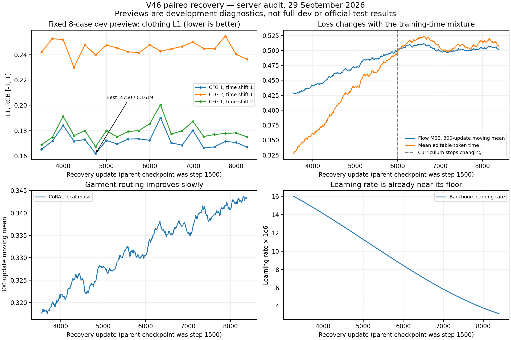

# V46 paired recovery: training plateau audit, 29 September 2026

**Later update:** Training was stopped and the preserved update-8250
checkpoint received full-dev and garment-dependency audits. See the
[completed diagnosis](v46_step8250_failure_diagnosis_20260929.md) for final
measurements. The running-state details below describe the earlier inspection.

The current run is healthy operationally, but its eight-case development
previews show a quality plateau. Fine lettering remains distorted. There is no
evidence of a recurrence of the earlier cross-pair corruption. This audit does
not establish performance on all 256 development cases or the official test set.

## Active server and paths

- SSH: `ssh root@155.103.252.91 -p 46507`.
- Repository: `/workspace/pf-vton-27-9/pf-vton`.
- Dataset: `/workspace/pf-vton-27-9/high-resolution-viton-zalando-dataset`.
- Config: `configs/vton_v46_pfi_1024_paired_recovery.yaml`.
- Run: `logs/vton-v46-pfi-1024-paired-recovery`.
- Console log: `logs/vton-v46-pfi-1024-paired-recovery.resume.log`.
- Process: PID 22079, running inside tmux; no training Supervisor entry.

During inspection, training advanced through recovery update 8400, with 100%
GPU utilization and about 38.7 GB reported GPU memory use. The GPU identifies
as RTX 4090 with 49,140 MiB total memory. The container has a 64 GB filesystem,
with approximately 22 GB free. Recent updates take about 15 seconds each.
All numeric values in the inspected training log are finite; its step counter
advances continuously from 3260 without a rewind.

## Data and resume checks

Both current pair files match the historical split and the fingerprints stored
in both available full checkpoints:

| Split | Rows | Mismatched person/garment identities | SHA-256 |
| --- | ---: | ---: | --- |
| Fit | 11,391 | 0 | `2e6e879bf0706a8f66dd26e491dd10fdf3e3596de1d514ee5408a32f202be1ad` |
| Dev | 256 | 0 | `2c5bb4147cc5da88f9139f6822c763e7754b7d6ee1754e0ab04b040e7106c5fd` |

The pair validator also confirms no duplicate people or fit/dev identity overlap.
Each of the seven required modality folders contains 11,647 files. Selected
person, cloth, agnostic and DensePose images are native 768 pixels wide by 1024
high. These folder counts and sample dimensions do not constitute a full image
decode audit. Pair files currently have mode 0664; checkpoint fingerprint checks
remain enabled.

| File | Saved update | Optimizer steps | Curriculum ramp start |
| --- | ---: | ---: | ---: |
| `latest.ckpt` | 3250 | All 3250 | 1 |
| `latest.pt` at inspection | 8250 | All 8250 | 1 |

The live command resumed `latest.ckpt` at 3250. Subsequent saves go to
`latest.pt`. Optimizer learning rates, curriculum state, and data fingerprints
are consistent with that continuation. The training, model, sampler, dataset,
pair-validation, CoRAL, VAE wrapper and base PFT source files match local source
after normalizing line endings. Training hyperparameters in the two checkpoint
configs agree; data/output paths moved, retention changed, and preview batch size
changed from 2 to 4.

**For a future restart, use `--resume auto` or the current `latest.pt`.** Repeating
the current command with `latest.ckpt` would roll back to update 3250. The standard
`scripts/run_pfi_v46_paired_recovery.sh` already selects `--resume auto` when
`latest.pt` exists.

## Measured progress

All entries below are from the current server's fixed eight-case preview,
dual-loop 8, CFG 1, time shift 1. Lower L1 is better, RGB range is [-1, 1].

| Recovery update | Clothing L1 | Editable-region L1 |
| --- | ---: | ---: |
| 3500 | 0.165241 | 0.133324 |
| 4750, best logged clothing L1 | 0.161934 | 0.128138 |
| 6000 | 0.172312 | 0.135476 |
| 7000 | 0.180230 | 0.137327 |
| 8000 | 0.170625 | 0.132235 |
| 8250 | 0.166988 | 0.131036 |

Update 8250's clothing error is 3.12% above the best preview and 1.06% above
update 3500. There are modest fluctuations, rather than sustained improvement
over these 4750 additional updates. This is not a statistical claim that update
4750 is the best model overall: only eight cases and one noise seed per case
are evaluated.

At 8250, CFG 2 gives clothing L1 0.236430, versus 0.166988 with CFG 1. The
default resolution-shifted sampler (shift 2, CFG 1) gives 0.175053. CFG 1 with
shift 1 is consistently the strongest of these three logged settings. CFG 2
also costs 16 person-denoiser calls for eight sampler evaluations, exceeding
the target of fewer than ten model calls.



The preview implementation averages mask-area-weighted batch metrics. Changing
preview batch size from 2 to 4 changes the aggregation. Therefore old-server
preview values must not be directly equated to current values without
recomputing equal-per-image metrics. All rows in the table above use batch size
4. The installed VAE encoder uses the posterior mode, and the sampling noise is
seeded per case; random posterior sampling does not explain these fluctuations.

## Visual findings

Selected saved previews at 3500, 4750 and 8250 were downloaded under the user's
existing authorization to inspect preview images. At CFG 1 / shift 1:

- Lee remains an incorrect set of letter shapes at all three updates.
- GAP remains recognizable, but letter shape and placement differ from target.
- FILA changes across updates, with incomplete or distorted lettering and an
  incorrect neckline that persists.
- Wrangler's white text remains malformed; the orange collar is not recovered
  correctly in these samples.

The model preserves the broad garment appearance substantially better than the
previous cross-pair-damaged model, but has not solved garment structure and
exact lettering. This is more than an image-sharpness problem.

The diagnostic crop comparison is in the ignored local file
`logs/server-audit-20260929/logo-comparison.png`. Its source images are saved
JPEG previews; the crops are for visual inspection, not quantitative scoring.

## What the training objectives show

The time mixture stops changing at about update 6001. Comparing after that point
avoids attributing changes in average loss solely to learning while the sampled
task itself changes.

| Update window | Mean flow loss | CoRAL local mass | Decoded images per microbatch | Mean backbone LR |
| --- | ---: | ---: | ---: | ---: |
| 6010–7000 | 0.505609 | 0.336435 | 0.5995 | 7.10e-6 |
| 7010–8000 | 0.501358 | 0.340349 | 0.5885 | 4.76e-6 |
| 8010–8390 | 0.502516 | 0.343763 | 0.5949 | 3.46e-6 |

Flow loss is almost flat under this stable mixture. CoRAL routing improves
slightly, but that improvement does not establish correct text reconstruction.
The current LR is around 3.2e-6, versus the backbone peak of 2e-5, so simply
extending the existing schedule is not well supported as a way to fix lettering.

Code inspection identifies plausible limitations, **not proven causes**:

1. The final mixture is 10% pure noise, 15% synchronous, 40% late detail and 35%
   LTG. Decoded RGB/high-pass supervision requires mean editable time at least
   0.65, has probability 0.5, and is capped at one image per four-image
   microbatch. Approximately 0.59 images per microbatch receive this loss:
   about 15% of training-example exposures.
2. Decoded supervision uses the predicted endpoint of a ground-truth-interpolated
   training state, `x_t + (1 - t) v_theta`. At late times, the input already
   contains strong target-image information. Good reconstruction there does not
   demonstrate that an eight-call rollout can create the same letters from
   noise. The endpoint's direct sensitivity to velocity is also scaled by
   `(1 - t)`.
3. RGB and high-pass losses have no explicit word-identity target. A sharp,
   incorrect letter can still escape the intended notion of logo correctness.
4. Existing previews do not distinguish sampler error from model error or VAE
   reconstruction limits.

## Checkpoint retention issue

Every numbered snapshot from 3500 through 8000 was skipped with:

```text
skip snapshot ...: 21.9 GB free < 24.0 GB
```

The full resumable `latest.pt` is being updated. Neither the best-preview 4750
weights nor other intermediate weights from this continuation are retained.
Furthermore, `keep_every: 500` would not save 4750 even with sufficient space;
evaluation now happens every 250 updates. There is no best-metric save policy.

A storage-aware follow-up should retain a bounded number of weights-only
checkpoints and save the best evaluated model, while reserving enough space
for the approximately 7.6 GiB temporary full checkpoint used during atomic
replacement. Do not remove the only older checkpoint before preserving a
verified recovery option.

## Recommended next experiment

Before changing the training objective or extending training, evaluate an
immutable current checkpoint and the retained 3250 checkpoint on all 256 paired
development cases using equal-per-image metrics. Use identical noise and
conditioning, and compare dual-loop 8, Euler 8, and a 50-call reference at CFG 1.
Also reconstruct target images through the VAE and measure teacher-state versus
actual-rollout errors across time. The existing
`scripts/audit_pfi_timesteps.py` supplies most of this profiling; a matched VAE
reconstruction check is also available in the repository.

- If the long rollout is much better, investigate the short sampling trajectory
  and training on rollout states or distillation.
- If both rollout lengths fail similarly but VAE reconstruction preserves the
  letters, investigate garment correspondence and detail supervision.
- If VAE reconstruction already loses the letters, quantify that bottleneck
  before spending more updates on the denoiser.

The current inspection did not run a second GPU workload alongside the active
trainer, alter training code/configuration, restart the process, or delete any
checkpoint. Training remains running. Only local audit artifacts were written.
