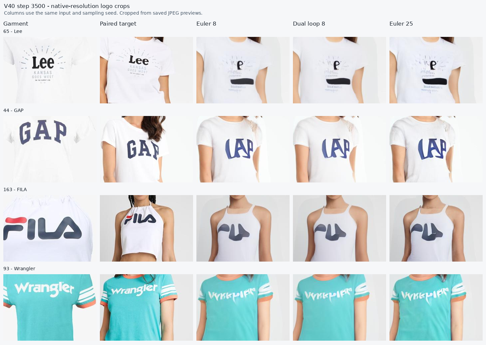
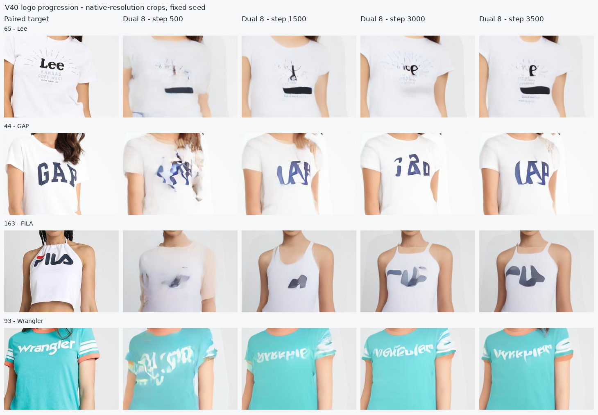
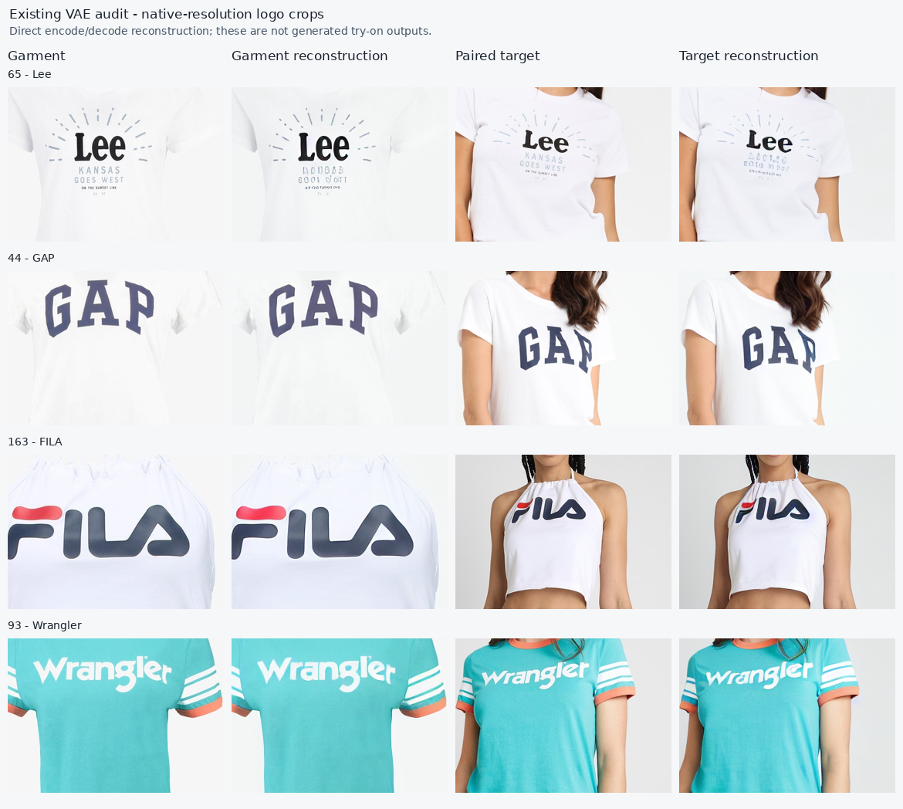

V40 training audit — 23 September 2026

V40 is learning garment appearance and body structure, but it has not yet demonstrated faithful logo transfer. The next experiment should improve the information and supervision available for reconstructing the actual letters, while measuring quality at eight denoiser evaluations. Moving directly to 1024×768 or simply increasing sampling steps would leave several demonstrated problems unresolved.

I inspected the running server, its resolved configuration, training metrics through step 3520, all seven saved evaluation records through step 3500, and preview crops from steps 500, 1500, 3000 and 3500. The local and remote PFI trainer, model, sampler, CoRAL implementation and time-schedule files have identical SHA-256 hashes. I also ran a CPU-only check of the actual detail sampler and inspected the existing VAE audit. These observations required no new GPU generation or changes to the running training job.

The underlying evidence is saved in [audit-summary.json](assets/v40-audit/audit-summary.json), [eval.jsonl](assets/v40-audit/eval.jsonl), and [resolved_config.yaml](assets/v40-audit/resolved_config.yaml).

**What the run establishes.** The active configuration uses the released PFT-XL/2 checkpoint, full backbone finetuning, cached one-way garment attention, DINOv3-S/16 correspondence supervision, an effective batch size of 16, and no EMA. The curriculum gate opened at step 1500 with correspondence-local-mass EMA 0.4116; its ramp completes at step 4500. At step 3500 the probabilities are 23.33% pure noise, 16.67% synchronous, 26.67% detail, and 33.33% ordinary LTG. Only 17.5% of the planned 20,000 optimizer steps had completed at that evaluation, about 4.9 training-set passes by example count. It is too early to declare the model converged.

The following values are clothing L1 on the same eight paired development cases. Lower is better. Values use RGB in [-1,1] and the trainer's mean of two pixel-weighted microbatch scores, not a uniform mean of eight per-image scores.

| Training step | Euler, 8 evaluations | Dual loop, 8 evaluations | Euler, 25 evaluations |
| ---: | ---: | ---: | ---: |
| 500 | 0.22094 | 0.21774 | 0.23571 |
| 1000 | 0.20045 | 0.19803 | 0.21532 |
| 1500 | 0.19271 | 0.19189 | 0.20444 |
| 2000 | 0.19636 | 0.19436 | 0.20889 |
| 2500 | 0.20256 | 0.20184 | 0.21290 |
| 3000 | 0.18629 | 0.18214 | 0.19724 |
| 3500 | 0.20827 | 0.20224 | 0.23038 |

Dual loop beats Euler at eight evaluations in every saved record, but the relative gain is only 0.36–2.90%. Euler 25 has worse clothing L1 than Euler 8 in every record. At step 3500, Euler 25 is 13.9% worse than dual loop 8. This does not prove that every perceptual metric gets worse with more steps; it does show that extra integration steps are not a demonstrated cure for this model's detail errors.

The early training improvement is real. Mean flow loss drops from 0.694 over steps 10–100 to 0.409 over 1410–1500. It is 0.437 over 3410–3500. These later windows have different time mixtures, so their raw losses are not directly comparable learning curves. Log validation flow loss in fixed time bins and by example type before using it to judge the curriculum. CoRAL local mass rises from 0.084 to 0.491 across those first and last windows, while correct-character reconstruction remains poor.

Step 3000 is the best recorded clothing-L1 preview, but it is not an established best model. Only eight paired cases and one noise seed are represented. At inspection, the directory retained a step-2500 weights snapshot and an overwritten latest checkpoint, not a step-3000 snapshot. Future selection needs retained checkpoints at evaluations or a best-checkpoint policy.

**What the images establish.** Garment colors, sleeve structure and bodies improve strongly from step 500. The remaining errors include changed letter shapes and placement, rather than blur alone: Lee loses letters and acquires a dark bar, GAP has a malformed first letter, FILA loses/merges strokes, and Wrangler becomes a different sequence of shapes. The three samplers preserve very similar errors at step 3500. A sharpening loss alone can make an incorrect word sharper.





These are native-resolution crops of the saved JPEG previews, without enhancement. They support visual observations; I did not compute precision image metrics or OCR accuracy from these lossy previews.

**The detail branch is not predominantly late-time training.** In [EditTimeSampler](../vton_ext/pfi_train.py), `detail_range: [0.70, 0.98]` chooses `t_bar`. The subsequent [LTG function](../patch_flow/timestep_schedules.py) samples approximately

```text
t_patch = t_bar - abs(N(0, 1)) * min(t_bar / 2, ltg_std)
```

Negative results are replaced with a uniform sample between zero and `t_bar`. Thus `t_bar` acts as an upper bound, despite the method name `get_time_with_mean`. With `ltg_std=0.6`, the active standard deviation is always `t_bar/2` for these times.

A CPU run of the actual server `EditTimeSampler`, forced to the detail branch, sampled 4096 examples × 768 tokens: mean time **0.5304**, **25.11%** above 0.7, **10.10%** above 0.8, and only **1.95%** above 0.9. An independent NumPy reproduction with one million samples per component gives similar results. Under the intended final mixture, only approximately **5.64% of editable patch times exceed 0.8**, and **1.03% exceed 0.9**. The configured 40% detail-example probability does not mean 40% of patch times are near clean.

The first controlled change should give the detail branch its own narrow lag distribution. A concrete starting hypothesis is `t_max ~ U(0.75, 0.98)` and `t_patch = t_max - abs(N(0, 0.05))`, with negative-tail handling retained. Keep ordinary LTG and nonzero pure-noise coverage. Do not globally narrow LTG: the grounding and mixed-time branches have different purposes. Measure the resulting histogram rather than trusting the label “detail.” These numerical settings are an experiment proposal, not measured optimal settings.

The present test in `tests/test_pfi.py` checks whether an example's *maximum* time exceeds 0.7. That cannot detect low late-time coverage across its individual patches. Any implementation change should verify both the per-patch distribution and the intended clean-context pattern.

**CoRAL establishes approximate routing, not successful detail transfer.** Actual person attention in [pfi_model.py](../vton_ext/pfi_model.py) normalizes over concatenated person and garment keys. The supervised map separately applies softmax over garment keys. Consequently, it can learn a good distribution *conditional on attending to the garment* while allocating little total attention to that garment in the real attention operation. This is a limitation of the current diagnostic, not proof that the run ignores its garment.

Log actual garment attention mass under the joint softmax, and actual mass on the reliable garment neighborhood, separately from the existing garment-conditional local mass. Evaluate matched correct-garment, shuffled-garment, and null-garment inputs at fixed seeds. Run these interventions at the start and at late states: a nearly clean ground-truth training state can let the model read the original lettering from itself instead of using the supplied garment.

The spatial teacher and transformer currently use a 32×24 token grid. `gaussian_sigma=0.04` corresponds roughly to a 20-pixel vertical / 15-pixel horizontal standard deviation at 512×384; the reported local mass uses a two-sigma neighborhood. That metric is much coarser than individual letter strokes. This does not make 16-pixel tokens a hard minimum feature size, but it explains why improved coarse correspondence is insufficient evidence of correct lettering. The logged reliable fraction near 0.16 is over *all person tokens*, including exclusions for masks and garment dropout; it is not “only 16% of garment pixels are reliable.” Measure reliability specifically on annotated text/logo regions.

V40 also uses a Gaussian cross-entropy target with a small DINOv3-S teacher. The published CORAL setup uses correspondence-coordinate regression plus entropy and a DINOv3-B teacher on a much stronger pretrained generator. Its loss coefficients cannot be copied directly into this differently normalized objective. The paper motivates correspondence supervision; it does not establish that this implementation has the same performance. [CORAL paper](https://arxiv.org/html/2602.17636v1)

**The current objective does not directly score readable letters.** [training_loss](../vton_ext/pfi_train.py) contains latent velocity MSE, uncertainty NLL, and CoRAL. `clothing_boost` weights the whole clothing region uniformly. There is no decoded image, text-recognition, or localized logo-structure loss in this PFI trainer. Existing losses in the older VTON trainer do not automatically apply to v40.

After the sampler-only ablation, test a modest decoded endpoint loss on visible text/logo crops, with both structural and appearance supervision. The correct per-patch endpoint is `z_hat = z_t + (1 - t_patch) * v`. Use a gradient-enabled decoder such as `decode_latents_with_grad`; the ordinary `decode_latents` helper disables gradients. Start with a small decoded microbatch because decoder activations add memory. Combine a crop reconstruction/perceptual term with a small multiscale edge term. For readable words with verified labels, test a frozen recognizer's differentiable feature or recognition loss; retain visual logo checks for stylized marks the recognizer cannot read. Training-only target boxes and labels must never become inference inputs.

Avoid using high-pass energy as the acceptance metric: incorrect letters and noise can both raise it. Avoid immediately replaying the old warper/detail-paste approach: the repository's earlier V29–V33 audit (`docs/vton_information_pf_audit.md`, now in `../patch-forcing-vton-legacy-v1-v33.tar.gz`) records letter deformation and cases where more refinement worsened logo fidelity. The PFI baseline is useful enough to test controlled changes before adding that complexity.

**The VAE is a contributor, but has not been established as the main cause.** The existing 12-case VAE audit records mean clothing reconstruction L1 0.04028 and high-pass L1 0.03163. Those numbers use different cases/weighting from the generation table and cannot be divided into it to estimate a precise bottleneck fraction. The server's installed encoder uses the posterior mode, so stochastic VAE sampling is not the explanation for checkpoint-to-checkpoint preview variation. The direct reconstruction crops allow large-character preservation to be assessed separately from generation.



In these crops, the large Lee, GAP, FILA and Wrangler marks survive direct reconstruction recognizably, whereas v40 changes their structure. The small print beneath Lee is already degraded by the VAE. This separates two problems: large-logo failures that the current representation can in principle avoid, and tiny-text losses that may require higher resolution or a different representation.

**Some person-detail failures originate in the mask.** In case 115, the agnostic input erases much of the checkerboard trousers. The generated trousers become gray/noisy, while only scattered observed checker pixels remain. The shirt reference cannot supply the missing trouser pattern. There are also visible seams around the broad editable regions. Audit inference-available parsing and known-context preservation independently of garment generation. Preserve confidently visible non-target clothing, hair and skin where they should stay visible, while allowing genuine garment occlusions and avoiding original-shirt leakage. Simply tightening every mask is not a valid solution.

**Eight-step inference needs its own validation and training evidence.** The current dual loop uses four outer intervals × two evaluations. Approximately the highest-uncertainty 30% of editable patches take two smaller updates per interval; other patches take one larger update. Every network call still processes the full person stream. The method reallocates updates/context, not sparse compute. This is consistent with the role of adaptive sampling described in the [Patch Forcing paper](https://arxiv.org/html/2604.19141v1).

The uncertainty head is trained against velocity residuals on interpolations of ground-truth latents. Its NLL does not prove that it identifies logo errors on generated trajectories. Compare dual 8 with Euler 8, random-hard-patch dual 8, and a few predefined uncertainty percentiles. Measure uncertainty/error rank correlation and selection coverage on text regions separately from skin and mask edges.

For the trajectory audit, compare clean-endpoint errors on ground-truth interpolations and on generated states at the same per-patch times. Do not treat the original `x1-x0` as a uniquely correct recovery velocity after a rollout leaves that straight path. A large generated-state endpoint gap would justify adding a small proportion of detached generated-state recovery examples or short-trajectory distillation. Late ground-truth interpolation alone does not teach correction of confidently misspelled model outputs.

The final inner call can see easy editable tokens already at t=1 while hard tokens are at t=0.875. The current detail branch never gives editable patches t=1. A later schedule ablation should include controlled two-level states matching the actual sampler, and exclude already-finished context tokens from velocity regression. Mix this with grounding examples; universally exposing clean target patches can create the context leakage that PF was designed to avoid.

At the current CFG scale of one, eight reported evaluations really are eight person-denoiser calls. If CFG is enabled, `predict` executes a second unconditional call but increments its counter only once: “8 NFE” would then mean 16 person-denoiser calls in this implementation. Count both calls, and report the once-per-garment encoder plus VAE/preprocessing latency separately. Preserve cached garment encoding in any proposed extension.

**Recommended experiment order.** Let v40 reach the end of its existing curriculum ramp and retain the step-5000 baseline. This preserves a clean comparison and avoids declaring failure from a handful of pre-ramp-completion previews. Continue beyond that based on fixed validation quality, rather than an assumption that all 20,000 steps will repair letters.

| Experiment | Change relative to the same saved baseline | Main question |
| --- | --- | --- |
| A | Actual late-time detail sampling only | Does better late coverage improve letters and the 8-versus-25 behavior? |
| B | A plus localized decoded text/logo supervision | Can the model preserve the exact visible marks, not merely sharpen them? |
| C | Best A/B variant plus a small generated-state recovery component, if the rollout audit warrants it | Can the model correct its own trajectory errors within eight calls? |
| D | Fine garment features/local retrieval only if routing interventions still reveal a limitation | Is source detail inaccessible through the present latent garment stream? |

Use equal additional training exposure, the same starting weights, the same mask/data settings, and retained checkpoints for the baseline and each ablation. Record whether optimizer and curriculum state are resumed or reset. First use a short pilot; a new long run is justified only by improved held-out logo fidelity. A mask-preservation experiment is separate from these garment-detail ablations.

For D, keep the cached garment stream and test a small, cached high-resolution garment-feature path with locally constrained retrieval guided by coarse correspondence. Require it to preserve source letter structure under folds/occlusion. This is a research hypothesis, not a finding that the present stream necessarily discards those features. Inspect pseudo-correspondences before increasing entropy pressure or forcing sharper matches onto uncertain teacher labels.

If a higher-evaluation or external VTON teacher eventually produces demonstrably correct details, distill that behavior into an eight-evaluation student and then test four or six evaluations. The present 25-evaluation v40 output is not a demonstrated superior teacher. Adaptive integration alone is not a guarantee of good generation under ten calls. Also, the PF paper's text-rendering experiments use a separately trained text-to-image system; they are not evidence that the ImageNet PFT-XL/2 initialization already has that capability. [Patch Forcing experiments](https://arxiv.org/html/2604.19141v1#S4.SS5)

**What “proved good at 512×384” should mean.** Keep the eight difficult previews as regressions, but select models on the full 256-case development split. The current 11,391 fit / 256 dev lists have no overlapping person or garment filenames; visual near-duplicate garments were not checked. Add a fixed unpaired development protocol constructed from dev garments. Use verified readable-text labels with character/word accuracy and report coverage, logo crop structure/perceptual error, clothing LPIPS/SSIM, and preservation of visible person/context. Unpaired images have no paired pixel target, so assess reference fidelity and preservation separately. Reserve the official test set for final comparison.

An acceptable next stage needs correct large logos across varied unseen garments, a reproducible gain at eight actual denoiser calls, and no material regression in garment fit or person preservation. Uncertainty scheduling must beat a matched simple sampler to justify its complexity. FID on eight previews is not useful evidence; use standard full-split metrics for benchmark claims and compare baselines under the same resolution, preprocessing and compute accounting.

After these conditions hold, finetune progressively to 1024×768 and reassess the VAE/text-size limit at that resolution. With the same VAE and patch size, each stream grows from 768 to 3072 tokens: four times the tokens and sixteen times the pairwise-attention work, though total runtime does not scale by exactly sixteen because other operations differ. The fixed rectangular position table and checkpoint-loading shapes also need an explicit resolution-transfer path. Higher resolution should improve the sampling of small marks; it does not by itself correct wrong correspondence or wrong letter identity.
