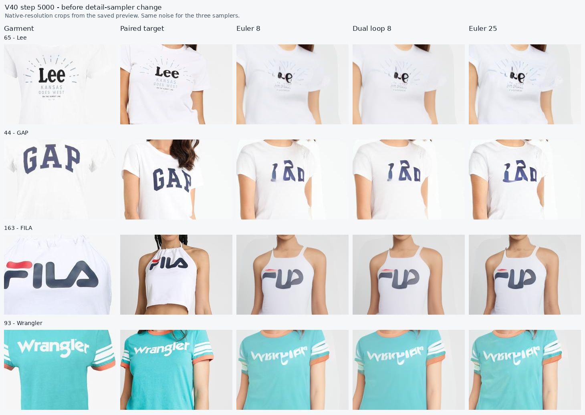
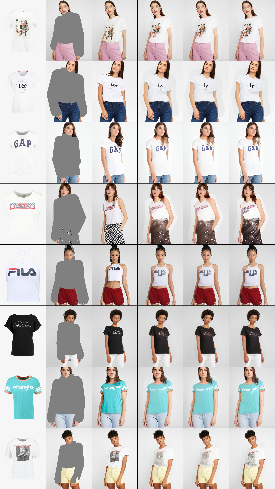

V41 detail-time pilot — 23 September 2026

The step-5000 review supports testing the detail-time correction proposed in the [v40 audit](vton_v40_training_audit.md). The original curriculum has completed, but large logos still have incorrect letter shapes. Clothing L1 on the eight fixed paired development cases is 0.184109 for Euler 8, 0.182497 for dual loop 8, and 0.192129 for Euler 25. Dual 8 is only 0.88% better than Euler 8; its score is essentially unchanged from step 3000's 0.182144. These limited previews justify an experiment, not a claim that the run has converged.



The [saved evaluation records](assets/v41-audit/v40-eval-through5000.jsonl) and [baseline metadata](assets/v41-audit/baseline.json) retain the measurements used for this decision. The large Lee, GAP, FILA and Wrangler marks remain malformed across samplers; a narrower detail-time distribution is a plausible next test, but will not necessarily solve incorrect correspondence by itself.

The implementation adds optional `flow.curriculum.detail_std` in [EditTimeSampler](../vton_ext/pfi_train.py). V41 uses a per-example upper time in `[0.75, 0.98]`, with a half-normal lag whose standard deviation is capped at `0.05`. Ordinary LTG, synchronous times, pure-noise examples and the negative-tail replacement retain their prior behavior. Omitting `detail_std`, as v40 does, preserves the original sampler. The draw shapes and random-number consumption are also preserved, so changing the detail branch does not shift the other branches' samples under a matched seed.

A CPU audit of each actual sampler used 16,384 examples × 64 tokens with seed 12345:

| Measured patch-time statistic | V40 | V41 |
| --- | ---: | ---: |
| Mean time in detail examples | 0.5313 | 0.8250 |
| Detail patches above 0.8 | 10.22% | 60.95% |
| Detail patches above 0.9 | 1.96% | 18.28% |
| All editable patches above 0.8, final mixture | 5.61% | 26.14% |
| All editable patches above 0.9, final mixture | 0.96% | 7.48% |

The final mixture remains 10% pure noise, 15% synchronous, 40% detail, and 35% ordinary LTG. Training now logs `t_edit_gt_08` and `t_edit_gt_09` alongside the mean, so the distribution can be verified in actual batches. The flow loss before and after this distribution change is not directly comparable: late-time velocity regression has a different error distribution.

The first 330 resumed steps (33 ten-step log records, steps 5010–5330) measured 26.19% of editable patches above 0.8 and 8.14% above 0.9, close to the CPU predictions. Mean flow loss was 0.5279, mean CoRAL loss 0.5621 and mean gradient norm 0.2233; all logged values were finite. These training values establish stability and the intended sampling distribution, not visual improvement.

At step 5500, the fixed eight-case evaluation is mixed. Euler 8 mask L1 changed from 0.18707 to 0.18491 and dual-loop 8 mask L1 from 0.18442 to 0.18019, but clothing L1 worsened from 0.18411 to 0.19758 and from 0.18250 to 0.19113, respectively. Euler 25 clothing L1 worsened from 0.19213 to 0.21391. In the saved preview GAP's large letters look closer to the target, while Lee, FILA and Wrangler remain distorted and the Vans/checkerboard case is still poor. This is not enough to accept the time-sampler correction; training remains bounded to step 6000 for a broader paired audit. The full step-5500 optimizer checkpoint was preserved by hard link as `step0005500-resume.pt` and verified to share an inode with the step-5500 `latest.pt`.



The [standalone v41 configuration](../configs/vton_v41_pfi_detail.yaml) preserves the model, losses, CoRAL settings, data augmentation, batch size, optimizer settings and evaluation samplers. The pilot resumes the full v40 checkpoint at `logs/vton-v40-pfi-coral/step0005000-resume.pt`, retaining Adam state and the completed curriculum (`ramp_start=1500`). This checkpoint was hard-linked before `latest.pt` could be replaced. The previous source is backed up on the server under `logs/vton-v40-pfi-coral/source-before-v41/`.

`train.stop_at_step=6000` bounds the experiment to 1,000 additional optimizer steps. `train.max_steps=20000` remains the cosine learning-rate horizon. Lowering `max_steps` to 6000 would instead change the learning rate at resume and confound the sampler experiment. `keep_every=500` retains weights at the evaluations, with optimizer checkpoints every 250 steps. The full v40 step-5000 preview and evaluation record are copied into the pilot directory as its baseline; they were not regenerated.

The full-dev audit waiter preserves the full optimizer checkpoint as `step0005500-resume.pt` immediately after the step-5500 weight checkpoint appears. This keeps the earlier pilot point resumable if its visual quality is better than step 6000; `latest.pt` alone would be replaced at step 5750.

Thirteen CPU regression tests passed in [test_pfi.py](../tests/test_pfi.py), including late-time patch coverage, exact preservation of the legacy sampler and non-detail branches, random-stream preservation, resumed curriculum behavior, unchanged learning-rate factors and model settings, cached garment inference, and sampler evaluation budgets. The launcher also passes shell syntax validation. The original checkpoint does not contain RNG/data-loader state, so resumption reseeds the loader; this is not a bit-exact continuation of the previous process.

The server process is managed as `pfi-v41-detail` using the [launcher](../scripts/run_pfi_v41_detail.sh) and [Supervisor configuration](../configs/supervisor_pfi_v41_detail.conf). The launcher uses the pilot's latest checkpoint if present and otherwise uses the preserved v40 step-5000 resume checkpoint. A successful completion at step 6000 does not restart the process.

On the training server, inspect progress with:

```sh
supervisorctl status pfi-v41-detail
tail -f /workspace/patch-forcing-vton/logs/vton-v41-pfi-detail.log
```

The resulting metrics, previews and checkpoints live in `/workspace/patch-forcing-vton/logs/vton-v41-pfi-detail/`. `pilot_provenance.json` records the parent checkpoint and installed source hashes; `time_distribution_audit.json` records the CPU distribution measurements. Compare the step-5500 and step-6000 results with step 5000 at the same sampling budget. Acceptance requires improved letter structure and appearance without a material regression in garment fit or person preservation. Lower aggregate clothing L1 alone is insufficient. A matched v40 continuation from the same resume state would be needed to isolate the change's causal benefit from additional training.

The [full-dev audit launcher](../scripts/run_pfi_v41_full_audit.sh) is also installed as Supervisor program `pfi-v41-full-audit`. It waits for a successful step-6000 exit before using the GPU. Its [audit script](../scripts/audit_pfi_timesteps.py) generates paired outputs on all 256 train-dev cases with Euler 8, dual-loop 8, Euler 25 and Euler 50, using the same noise per case for both checkpoints. It computes masked RGB and high-pass L1 plus SSIM, with a clearly labeled target-color contrast proxy for graphics. A fixed 64-case subset, including the eight logo-heavy previews, additionally gets teacher-forced and rollout endpoint profiles over time. The [comparison script](../scripts/compare_pfi_audits.py) writes paired final-score deltas and time curves. A [crop-sheet script](../scripts/plot_pfi_logo_comparison.py) puts native-resolution Lee, GAP, FILA and Wrangler crops side by side for visual assessment. Outputs will be under `logs/vton-v41-pfi-detail/full-dev-audit/` on the server. These measurements were tested on one-case GPU runs and six CPU unit tests; full-dev results are pending.

For model choice, prioritize paired full-dev clothing and contrast-region error at eight evaluations, plus readable structure in the four logo crops. Cloth SSIM and 50-evaluation behavior are supporting diagnostics; the target deployment budget remains below ten evaluations. The fixed-noise comparison is a quality comparison between step 5000 and step 6000, not a causal ablation of the time sampler, because the checkpoints differ by 1,000 optimizer updates. A matched V40 continuation would be required for that causal claim.

The final comparison also writes `time-coverage-vs-error.png`, which places the sampled V40/V41 final-mixture patch-time histograms above the matched teacher velocity-error curves. This helps distinguish poorly trained time ranges from accumulated rollout error. Its 8,192-example CPU sampling check reproduced V40/V41 coverage above 0.8 as 5.64%/26.24% and above 0.9 as 1.02%/7.85%; these are sampled schedules, not historical batches.

During V41 training, the server's entire `logs/vton-v40-pfi-coral/` directory disappeared, including the hard-linked step-5000 checkpoint and the step-5250 resume checkpoint. I searched `/workspace`, `/root`, `/tmp` and other mounted paths for another copy and found none; the fixed eight-case V40 evaluation record and [preview crops](assets/v41-audit/logos-step5000.png) remain in the V41 audit assets. The full-dev launcher now uses V40 step 5000 if a copy is restored at its original path before the audit starts; otherwise it uses the preserved V41 step-5500 weight checkpoint as the baseline and compares that with V41 step 6000. The latter still yields matched 256-case quality and 64-case time-range diagnostics, but it cannot establish full-dev improvement against V40. The figure labels are generated from the baseline actually used.

To protect the current pilot from further log cleanup, the step-5500 full and weight checkpoints are also hard-linked under `checkpoints/pfi-safety/`; they currently share their original inodes and consume no extra data blocks. The full-dev waiter will hard-link the completed step-6000 checkpoints there before starting inference. If `latest.pt` later changes or the V41 log directory is cleaned, these checkpoint files remain available for model selection and resumption.

The proposed third-stage [decoded-detail candidate](../configs/vton_v42_pfi_decoded_detail.yaml) is prepared but has not been launched. It resumes the full V41 step-6000 optimizer state and adds sparse gradient-enabled VAE-decoded RGB/high-pass loss on editable garment pixels when average editable time is at least 0.65. At most one eligible image per microbatch is decoded, with a target-derived color-contrast weight that is never an inference input. The optional implementation defaults to zero weight, so it does not change V40/V41 training. Unit tests verify that its gradient reaches only selected latents. The V41 visual and full-dev audit will determine whether to run or retune this candidate; sharpening an incorrect logo would not count as progress.

After the audit, choose the parent from the measured V40 step 5000 and V41 step 5500/6000 checkpoints, then adjust the V42 resume path if needed. If the decoded pilot runs, check one full training step for GPU memory and finite gradients before allowing the bounded 500-step continuation. Compare its eight-evaluation outputs against the selected parent using matched noise and the same full-dev and logo-crop diagnostics. Keep the better checkpoint; the additional optimizer steps make a same-step control useful for a causal claim about the decoded loss.

A standalone 512×384 GPU decoder-backward smoke test on the server produced a finite loss and nonzero latent gradient, with 4.73 GiB peak allocation for that isolated process. This is a decoder-path check, not a full trainer memory measurement; the full V42 step must still be checked before any long run.

An attempted eight-case Euler-50/time-profile audit of step 5500 during training was interrupted by CUDA OOM: the trainer held 18.14 GiB and the diagnostic held 5.31 GiB on the 24 GiB card. The trainer survived and continued; the diagnostic directory has a `FAILED_CONCURRENT_OOM.txt` marker and no `complete.json`, so its partial rows are invalid. No more GPU diagnostic will run concurrently with V41. The Supervisor full-dev waiter starts only after the trainer's recorded step-6000 evaluation and exit.

To extend an accepted pilot beyond 6000, first change `train.stop_at_step` in its configuration to the chosen absolute step, keeping the original LR horizon unless a new schedule is intended. Then start the existing Supervisor program, which will resume the pilot's latest checkpoint. Model quality after the sampler correction is pending evaluation; the verified improvement so far is late-time training coverage.
