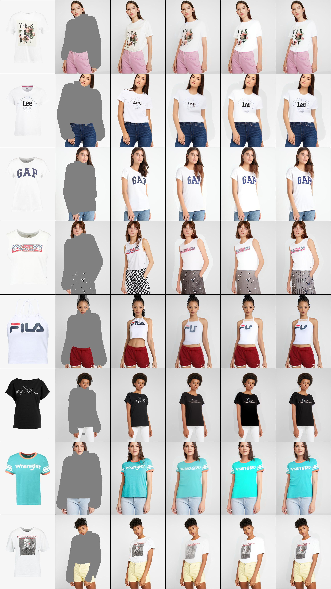

# V43 high-resolution review — 24 September 2026

V43 has the correct dimensions and transferable architecture for 1024 × 768,
but the original configuration was not a good continuation of the existing
V42 model. Use the V42 step-16000 weights with a fresh fine-tuning optimizer;
do not discard the learned try-on conditioning or try to restore a 512-resolution
position table with `--resume`.

## Evidence and starting checkpoint

The old V42 process was stopped at the user's request after its last logged
step 16190. The latest complete checkpoint is **step 16000**. Its full state is
preserved at `checkpoints/pfi-safety/v42-last-before-v43-resume.pt`; the extracted
weights are `checkpoints/pfi-safety/v42-step16000.pt`. V43 loads all 297 non-position
tensors from it and derives the new position table from the released PFT table.
The existing resolution-transfer regression test passes.

The old eight-case paired preview's unguided dual-loop-8 clothing L1 was
0.166575 at step 16000, compared with 0.182497 at the old V40 step 5000. V42
step 15000 was similar at 0.166556. These are limited preview measurements,
not evidence of a best checkpoint over the whole development set.

The parent visibly carries useful garment placement, shape, color and graphic
knowledge. GAP is recognizable, but Lee, FILA and Wrangler remain malformed.
The large agnostic region also forces regeneration of patterned trousers in
the Vans case. Higher resolution cannot by itself fix wrong letter identities
or restore information removed by that mask. This transfer preserves learned
conditioning and gives smaller marks more pixels; its quality benefit must
be measured after fine-tuning.

## What is already suitable

- Native dataset images are 768 pixels wide × 1024 high; this is real input
  detail rather than enlargement of stored 512-resolution images.
- The VAE downsamples by eight, giving 128 × 96 latents. Patch size two gives
  64 × 48 = 3072 tokens per stream and keeps pretrained embedding/output shapes.
  Only the fixed positional table depends on the token grid. The installed
  VAE encoder uses the posterior mode, avoiding random encoding noise.
- Garment K/V caching and selective denoising of editable tokens still apply.
  Sampling with `cfg=1`, `nfe=8`, `n_inner=2` uses eight person-denoiser calls;
  garment encoding and VAE work are additional costs. Four times the tokens
  does not imply the same latency per denoiser call as at 512 resolution.
- The resolution time shift has the correct direction for this code's
  noise-at-zero convention. A factor two follows the square root of the
  fourfold pixel-count increase. This is motivated by
  [the SD3 resolution-shift derivation, §5.3.2](https://arxiv.org/html/2403.03206v1#S5.SS3.SSS2),
  not evidence that two is optimal for this VTON sampler. The detail branch
  remains unshifted to retain near-clean training examples.

## Changes made

1. **Transfer recipe.** The fine-tuning config starts from V42 step 16000 with
   backbone peak LR `5e-6`, conditioning LR `1e-5`, and 100 warmup steps. It
   retains the final 10% pure-noise / 15% synchronous / 40% detail / 35% LTG
   mixture, with decoded loss active. The original grounding curriculum would
   spend thousands of updates relearning conditioning and disable detail loss
   during that period. A 1000-step pilot preserves a 10000-step LR horizon.
2. **Correspondence tolerance.** CoRAL coordinates are normalized image
   coordinates. Keep `gaussian_sigma=0.04` and `cycle_radius=0.10`. Halving both
   preserves token width but tightens garment-relative matching tolerance and
   changes the reliability/gate meaning. It is a separate hypothesis to test,
   not a necessary resolution conversion.
3. **Memory.** Compute frozen teacher targets before retaining the transformer
   backward graph. Checkpoint CoRAL loss intermediates and the gradient-enabled
   decoder; avoid stacking all dense attention maps for diagnostics. Regression
   tests compare both losses and gradients with the original computations.
4. **Reliable startup.** Missing resume checkpoints now fail instead of
   silently starting a fresh run. Model-only checkpoints require `init_from`;
   full optimizer checkpoints are required for `--resume`. Resume no longer
   redundantly loads the original initialization file. Validate image/latent
   dimensions, support zero data-loader workers, and reject non-finite gradients
   before updating the optimizer.
5. **Comparable previews.** Save step-zero evaluation scores, make preview
   noise independent of evaluation batch size, and compare time shifts one and
   two at the same eight-call budget. With four dual-loop outer intervals,
   shift two leaves a final easy-token jump from 0.6 to 1, versus 0.75 to 1
   without shifting. More early-noise resolution may trade off late detail.
   Move completed preview rows to CPU to limit memory during evaluation.

## Actual hardware and memory tests

The supplied server still has an RTX 3090 with 24 GB, and the user confirmed
using it for this run. The memory probe forces late detail times, no garment
dropout, and an active decoded loss. It allocates Adam state and tests accumulated
gradients; passing an early grounding step with decoded loss disabled would
not establish that the later training stage fits.

| Probe | Result |
| --- | --- |
| 1024 × 768, batch 1, full-image decoded backward | CUDA OOM; 22.22 GiB peak allocated before failure |
| 1024 × 768, batch 1, cropped decoded backward, first update | Passed; 10.76 GiB peak allocated |
| 1024 × 768, batch 2, cropped decoded backward, two updates × two microbatches | Passed; 20.30 GiB allocated, 22.61 GiB reserved; finite gradients |

The selected 24 GB variant uses **batch 2 × accumulation 8**, effective batch
16. The transformer still sees both complete 1024 × 768 images. Auxiliary
decoded loss uses a jittered 64 × 48 latent clothing window (512 × 384 pixels)
with four latent cells / 32 pixels of extra decoder context. Full-image
generation and evaluation are retained. Crop decoding approximates full-image
decoding; limited decoder context is a real tradeoff. The eligible-example
decode probability is one to keep detail supervision frequent with the smaller
microbatch and one-decoded-image cap.

The GPU probe used LR zero and saved no model changes. All **22 CPU regression
tests** passed, including cross-resolution weight transfer, sampler call budgets,
unchanged legacy time sampling, decoded gradients, and checkpointed CoRAL
loss/gradient equivalence. A 48 GB run with batch four/full-image decoded loss
has not been measured on that hardware.

## Run and acceptance

Supervisor program: `pfi-v43-1024`. Config:
[`vton_v43_pfi_1024_24gb.yaml`](../configs/vton_v43_pfi_1024_24gb.yaml).
Logs: `logs/vton-v43-pfi-1024-24gb/`. The step count restarts at zero for this
fine-tuning run; the parent is step 16000. Save full optimizer state every 100
steps, retained model weights every 500, and previews at 0/500/1000. Keep the
existing train/dev split; changing it would invalidate checkpoint comparison.

Judge the pilot against its **new 1024-resolution step-zero baseline**. The
new per-case seed scheme differs from the old preview scheme, so old eight-case
numbers are historical context rather than a matched numerical baseline.
Look for better letter shapes and texture at eight calls, supported by clothing
and graphic-region error, while checking fit and preserved person regions.
Training loss, a successful memory test, or higher resolution alone is not an
acceptance criterion. Extend the run only after reviewing the pilot previews
and broader paired development measurements.
